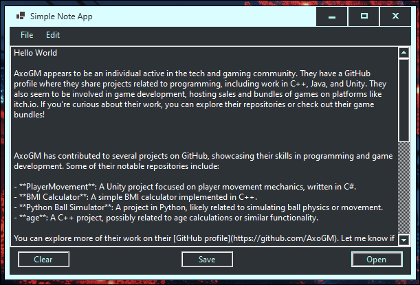
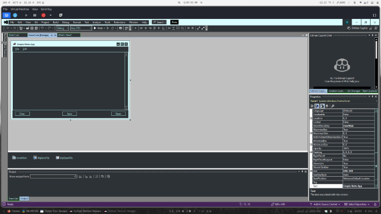
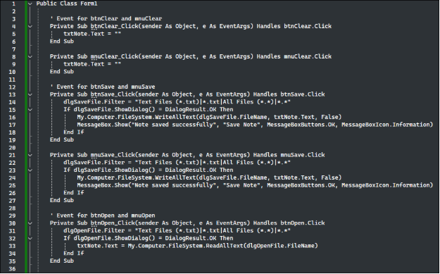
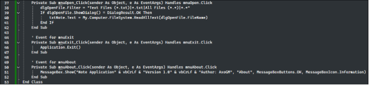
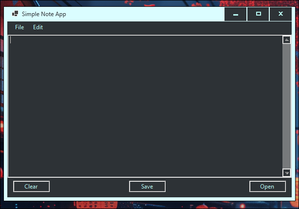
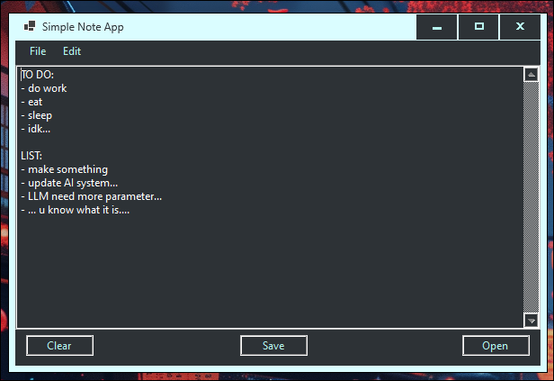
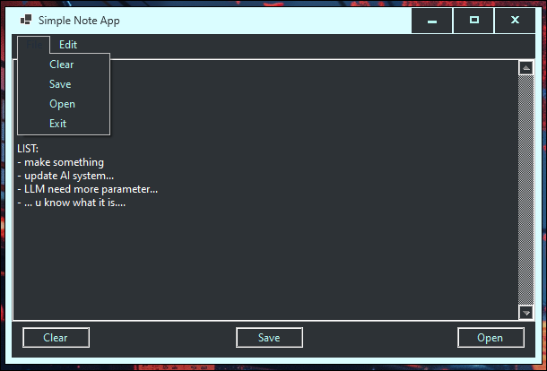

## Simple Note App

Requirement:

.NET 8.0 LTS (Long Term Support)

Windows 11/10

ABOUT:

Its same like Notepad but for text file only (.txt) and its a bit different from Notepad. There is a button to clear, save and open by click at button and File menu.

DESIGN:

|**Control Type**|**Name**|
| :- | :- |
|TextBox|txtNote|
|Button|btnClear|
|Button|btnSave|
|Button|btnOpen|
|MenuStrip|mnuMain|
|SaveFileDialog|dlgSaveFile|
|OpenFileDialog|dlgOpenFile|

txtNote:

Properties: Multiline = True, ScrollBars = Vertical.

mnuMain:

**File Menu**:

- Clear (mnuClear) – Clear the text area.
- Open (mnuOpen) – Open a note file.
- Save (mnuSave) – Save the current note.
- Exit (mnuExit) – Close the app.

**Edit Menu**:

- About (mnuAbout) – Show an about message.

Naming Prefixes:

- txt for TextBox
- btn for Button
- mnu for MenuStrip
- dlg for Dialog controls

CODE:

OUTPUT:

